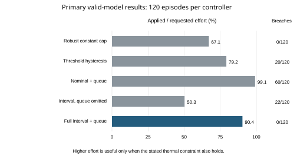

# Thermal Queue Governor

A reproducible research and patent discussion package for scalar motor thermal control with clipped temperature readings and delayed commands. The governor maintains a temperature interval, accounts for accepted FIFO commands, and admits effort against a conditional thermal bound.

This is a synthetic simulation prototype. It is not a validated hardware controller or a granted patent. Patentability, human inventorship, ownership, and filing readiness remain unresolved.

## Explore the landing page and interactive prototype

**[Open the live webpage](https://srinivasnampalli.github.io/thermal-queue-governor/)** · **[Jump to the interactive prototype](https://srinivasnampalli.github.io/thermal-queue-governor/#prototype)** · **[Watch the recorded walkthrough](https://srinivasnampalli.github.io/thermal-queue-governor/watch.html)**

The landing page explains clipped readings, queued heat, and command admission with a dark navy/copper design, subtle thermal animation, a 3D motor hero, and the full simulator. Its results comparison separates the complete 1,120-episode study from the 120 primary TQG episodes behind the zero-breach and 90.4% effort figures.

For offline use, save the repository's [single-file index.html](index.html) and open it in a modern browser. The page includes its styles, code, Three.js, D3, and license notices. No build, install, server, or internet connection is needed to run the prototype; external research and video links need internet access. The [standalone simulation view](https://srinivasnampalli.github.io/thermal-queue-governor/prototype.html) remains available too.

Click any of the 16 motor and drive components to highlight it and learn what it does. Explore the windings, bearings, encoder, sensor, phase connections, inverter, capacitor, and controller; rotate the assembly or open the exploded view. Run the thermal simulation, add commands, and watch the bounds and accepted FIFO update.

[](https://srinivasnampalli.github.io/thermal-queue-governor/watch.html)

The preview is an excerpt from an actual browser recording. [Download the full captioned MP4](demo/media/thermal-governor-walkthrough.mp4), or see the [demo source, controls, and test instructions](demo/README.md).

The original governor reduces effort when a full request does not fit. The optional waiting scheduler is a demo extension. The electrical components are explanatory geometry; electrical circuits and physical hardware are not simulated or validated.

## Read the work

- [Start here](START_HERE.pdf): scope, results, and limitations.
- [Research manuscript](RESEARCH_MANUSCRIPT.pdf): methods, comparisons, and actual simulation results.
- [Technical disclosure](TECHNICAL_DISCLOSURE.pdf): numbered embodiment and drawings.
- [Full review dossier](FULL_REVIEW_DOSSIER.pdf): 11 discussion claims, support matrix, prior art, evidence, and filing gaps.
- [Results workbook](RESULTS_DATA.xlsx): editable episode data and summary calculations.
- [Editable project](project/): source, configurations, tests, Markdown, figures, and research records.
- [Original research package ZIP](https://github.com/SrinivasNampalli/thermal-queue-governor/releases/download/v0.2.0/PROJECT.zip): retained as a release asset with its historical integrity manifest, rather than a large tracked file. Verify it with [PROJECT.zip.sha256](PROJECT.zip.sha256). GitHub release source archives contain the current source tree.
- [Additional test report](project/research/ADDITIONAL_TESTS.md): follow-up test coverage and the experiment-output path fix.

## Run locally

The Python controller, simulator, command-line demo, and research tests require only the Python standard library.

```sh
git clone https://github.com/SrinivasNampalli/thermal-queue-governor.git
cd thermal-queue-governor/project
python demo.py
python -m unittest discover -s tests -v
python run_experiments.py --config config/evaluation.json
```

New experiments create separate run folders. See [reproducibility instructions](project/REPRODUCIBILITY.md) for the preserved study pointers and source snapshots. GitHub Actions runs the test suite and demo on Linux and Windows with Python 3.12 and 3.13.

The interactive demo adds 23 JavaScript tests and browser checks for clickable components, simulation controls, waiting/expiry, and responsive layout. The landing-page acceptance test additionally verifies offline operation, hero selection, reduced-motion controls, and layouts from 320 to 1440 pixels. See [demo validation](demo/VALIDATION.md). The root manifest describes the current repository; the original research ZIP retains its historical internal manifest.

## Evidence and limits



The preserved final/post-main studies contain 1,120 episodes and 1,008,000 simulated transitions. In 120 primary episodes satisfying the declared model assumptions, the full controller had zero sampled thermal-limit breaches and delivered 90.4% of requested effort on average. A simpler constant cap also avoided breaches, delivering 67.1%.

The TQG mean is 90.3721%, with a post hoc paired-seed bootstrap 95% interval of 88.0190–92.4781%. Its paired improvement is 23.2526 percentage points (interval 20.8995–25.3586). The maximum is 104.9999719°C, only 0.0000281°C below the 105°C limit: a numerical boundary result, not an engineering safety margin. See the [reproducible spread and margin analysis](project/research/PRIMARY_EVIDENCE.md).

The repository also retains a separate 900-episode pilot: 2,020 completed episodes are present in total, while the headline 1,120 excludes that pilot. The [prior-art challenge](project/research/prior_art_challenge.md) records the novelty limitations.

In a separate applied-action mismatch study, the interval missed the true state 113 times while the internal validity flag still remained on. The flag does not authenticate the actuator or establish that model assumptions hold. No hardware or network protocol is validated.

The workbook and full review dossier preserve the original study and its 15-test review snapshot. The current manuscript adds the post hoc spread and numerical-margin analysis. Subsequent software tests and output-path fixes are documented separately; they do not add episodes or change the controller mathematics. Completed raw pilot, primary, and follow-up logs are included. An unusable interrupted raw stream is omitted; its interruption record is retained.

This repository publication is separate from any patent filing. No patent application has been submitted. Source-paper code, source-paper data, login credentials, and temporary build files are not part of this repository. See [third-party notices](project/THIRD_PARTY_NOTICES.md).

## Rights, citation, and provenance

Original materials remain [rights reserved pending review](LICENSE); this is not an open-source grant. Third-party dependencies retain their own licenses. [CITATION.cff](CITATION.cff) attributes SrinivasNampalli as project maintainer without determining patent inventorship. No DOI is claimed unless a verified Zenodo record is linked here.

Checksums verify file identity. The short Git history records source changes; it does not independently prove conception, priority, earliest public availability, or patentability. The [disclosure ledger](project/research/DISCLOSURE_LEDGER.md) records the public repository follow-up and unresolved timing facts.

The public website uses deferred local scripts with integrity hashes. The one-file offline download remains at the root. Pages artifacts and their copied media are generated by Actions instead of tracked again under `docs/`; the source media is stored once in `demo/media/`.
