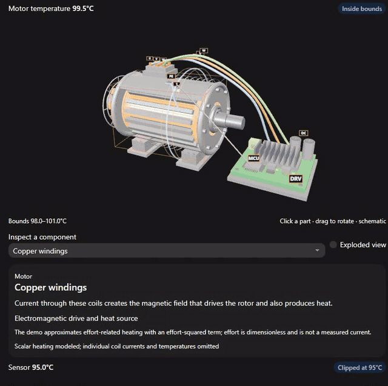

# Thermal Queue Governor

A reproducible research and patent discussion package for scalar motor thermal control with clipped temperature readings and delayed commands. The governor maintains a temperature interval, accounts for accepted FIFO commands, and admits effort against a conditional thermal bound.

This is a synthetic simulation prototype. It is not a validated hardware controller or a granted patent. Patentability, human inventorship, ownership, and filing readiness remain unresolved.

## Explore the interactive 3D demo

**[Launch the demo](https://srinivasnampalli.github.io/Patent/)** · **[Watch the recorded walkthrough](https://srinivasnampalli.github.io/Patent/watch.html)**

Click any of the 16 motor and drive components to highlight it and learn what it does. Explore the windings, bearings, encoder, sensor, phase connections, inverter, capacitor, and controller; rotate the assembly or open the exploded view. Run the thermal simulation, add commands, and watch the bounds and accepted FIFO update.

[](https://srinivasnampalli.github.io/Patent/watch.html)

The preview is an excerpt from an actual browser recording. [Download the full captioned MP4](demo/media/thermal-governor-walkthrough.mp4), or see the [demo source, controls, and test instructions](demo/README.md).

The original governor reduces effort when a full request does not fit. The optional waiting scheduler is a demo extension. The electrical components are explanatory geometry; electrical circuits and physical hardware are not simulated or validated.

## Read the work

- [Start here](START_HERE.pdf): scope, results, and limitations.
- [Research manuscript](RESEARCH_MANUSCRIPT.pdf): methods, comparisons, and actual simulation results.
- [Technical disclosure](TECHNICAL_DISCLOSURE.pdf): numbered embodiment and drawings.
- [Full review dossier](FULL_REVIEW_DOSSIER.pdf): 11 discussion claims, support matrix, prior art, evidence, and filing gaps.
- [Results workbook](RESULTS_DATA.xlsx): editable episode data and summary calculations.
- [Editable project](project/): source, configurations, tests, Markdown, figures, and research records.
- [Research package ZIP](PROJECT.zip): the original research project and reports, with its own integrity manifest. The newer interactive demo and recording are in [demo/](demo/).
- [Additional test report](project/research/ADDITIONAL_TESTS.md): follow-up test coverage and the experiment-output path fix.

## Run locally

The Python controller, simulator, command-line demo, and research tests require only the Python standard library.

```sh
git clone https://github.com/SrinivasNampalli/Patent.git
cd Patent/project
python demo.py
python -m unittest discover -s tests -v
python run_experiments.py --config config/evaluation.json
```

New experiments create separate run folders. See [reproducibility instructions](project/REPRODUCIBILITY.md) for the preserved study pointers and source snapshots. GitHub Actions runs the test suite and demo on Linux and Windows with Python 3.12 and 3.13.

The interactive demo adds 23 JavaScript tests and browser checks for clickable components, simulation controls, waiting/expiry, and responsive layout. See [demo validation](demo/VALIDATION.md). The root manifest describes the current repository; the original research ZIP retains its historical internal manifest.

## Evidence and limits

The preserved final/post-main studies contain 1,120 episodes and 1,008,000 simulated transitions. In 120 primary episodes satisfying the declared model assumptions, the full controller had zero sampled thermal-limit breaches and delivered 90.4% of requested effort on average. A simpler constant cap also avoided breaches, delivering 67.1%.

In a separate applied-action mismatch study, the interval missed the true state 113 times while the internal validity flag still remained on. The flag does not authenticate the actuator or establish that model assumptions hold. No hardware or network protocol is validated.

The reports and workbook preserve the original study and its 15-test review snapshot. Subsequent software tests and the output-path fix are documented separately; they do not add episodes to the reported research results or change the controller mathematics. Completed raw pilot, primary, and follow-up logs are included. An unusable interrupted raw stream is omitted; its interruption record is retained.

This repository publication is separate from any patent filing. No patent application has been submitted. Source-paper code, source-paper data, login credentials, and temporary build files are not part of this repository. See [third-party notices](project/THIRD_PARTY_NOTICES.md).
