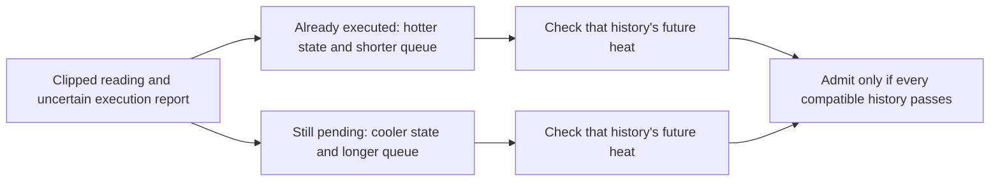

# Next technical step: admission with uncertain FIFO execution

**September 9, 2026. Status: proposed research direction with a verified arithmetic kernel, not an established patentable invention or a deployed controller.** The existing governor, eleven discussion claims, historical experiments, and pending motor-specific protocol are unchanged.

## The specific problem

The current governor assumes that the reported applied effort and remaining accepted FIFO are correct. Its earlier mismatch study showed that this assumption can fail without immediately clearing the internal validity flag. A narrower research problem is to decide safely when a temperature sensor is clipped and the controller cannot yet tell whether an accepted command has executed.

One possible history has already converted a command into heat; another still owes that command's future heat. Pair the temperature estimate with its own execution history. Combining the hottest temperature with the longest outstanding queue can count the same command twice. Trusting a guessed queue position can omit heat instead.

The working technical question is: **can a small, explicitly bounded representation of temperature and FIFO progress preserve the admissible effort decisions of full robust history prediction, including long clipped intervals, without enumerating every history?** This focuses the work on a testable representation, update rule, and computation bound.

## Proposed interface and state

Each possible execution mode retains `h = ([L_h,H_h], queue_head_h, idle_age_h, evidence_h)`. Temperatures are rises above the declared ambient. The head identifies a suffix of a shared immutable accepted-command list; idle age determines the remaining service-wait allowance. Evidence identifies what a delayed report actually observed and when.

Inputs are the timestamped clipped/missing temperature packet, accepted command identities and effort values, requested candidate effort, and execution evidence with an explicit reliability contract. Outputs are the greatest admitted grid effort, worst predicted prefix temperature, surviving mode count, and a reason when no candidate can be certified.

The initial version's contract must be explicit:

- Accepted commands execute exactly once and in order. Uncertainty concerns progress, not unknown command values, duplication, reordering, or partial execution.
- A service event applies that command for one model transition. An idle applies zero effort; it does not hold the previous setpoint.
- At most `D` consecutive idle steps occur while backlogged. A new candidate is appended consistently to every possible remaining suffix.
- The initial hypothesis set contains the actual state and execution mode. Model and observation bounds are valid.
- A received packet is not automatically proof of command execution or measured current. Untrusted reports cannot remove otherwise possible histories.

These are assumed software contracts, not verified properties of the unspecified motor or drive. Residual current in the new four-state virtual plant already shows why zero commanded effort need not mean zero heat on hardware.

## Update and admission sequence to implement

1. For each retained hypothesis, create every permitted successor: service the head or take an allowed idle step. Propagate temperature and queue progress together.
2. Intersect each successor with the temperature observation. A clipped reading `y=C` under noise-before-clipping gives only `x >= C-ambient-epsilon`. Missing data gives no new restriction.
3. Apply only justified, time-aligned execution evidence. Keep ambiguous cases. A current-energy counter alone cannot distinguish equal-energy commands or establish order.
4. Before merging modes, prove that the merge preserves all future-relevant queue, timing, and evidence information. An interval hull can be sound but conservative; it is not automatically an exact representation.
5. For each candidate grid effort, check every compatible queue suffix and future service timing, including current temperature, every idle/service prefix, and the post-candidate continuation.
6. Admit the greatest feasible effort. If an already accepted prefix is infeasible, report that failure; returning zero does not cancel the queue or prove a safe stop.



The history estimator, evidence reconciliation, and online merging are **not implemented** by the arithmetic calculator below. They remain the next engineering work.

## A concrete calculation already checked

This intentionally constructed example uses `x_next=.99*x+4*u^2`, ambient 25 C, temperature limit 105 C, sensor ceiling 95 C, and an effort grid of .05. From initial rise 74.9 C, a previously accepted effort .8 may have executed or may still be waiting. At most one zero-effort idle is allowed while backlogged.

| Compatible current history | Actual model temperature in the example | Remaining old command | Highest future temperature with new effort 1.0 |
| --- | --- | --- | --- |
| Old command executed | 101.711 C | None | 104.943890 C |
| Old command not executed | 99.151 C | Effort .8 | 104.2097951 C |

Both histories display 95 C. Every allowed future timing passes for effort 1.0. The Cartesian approximation combines 101.711 C with the still-pending .8 command from the other history and predicts a fictitious peak of 106.7188511 C. Its greatest admissible grid effort is .75. This is **100% versus 75% admitted effort in one constructed case**, not measured throughput, average performance, or proof of novelty. A full joint-history robust reference also admits 1.0.

The [exact-arithmetic calculator](../tools/check_joint_queue_example.py) checks all 21 effort-grid candidates against all permitted future timings. The [reproducible result](JOINT_QUEUE_EXAMPLE.json) contains every candidate and the four full-effort future peaks. No motor data or calibration is involved.

## A precise computation to formalize

For fixed scalar coefficients `0<a<1`, `b>=0`, `w>=0`, define the zero-input equilibrium `E=w/(1-a)`. After `d` zero-input idle steps,

`F0^d(z) = E + a^d*(z-E)`.

With an allowed wait of `0..D` steps, the greatest pre-service temperature rise is

`M_D(z) = max(z, E + a^D*(z-E))`.

Use the remaining wait allowance for the first command, then the full allowance after each service. For each effort `u`, update `z = a*M_D(z) + b*u^2 + w`, retaining both the pre-service and post-service maxima. Include `E` in the peak for indefinite zero input after the queue drains.

The proof argument is specific: the idle trajectory moves monotonically toward `E`, so its maximum over a bounded idle run occurs at an endpoint. Both the idle envelope and the service map are monotone. Maximizing successively therefore attains the worst state at each service index under these independent per-head wait rules. Current, idle, service, and tail maxima must all be checked. This can evaluate a given hypothesis and candidate in a linear number of queue steps instead of enumerating exponentially many wait schedules. It does not solve growth in the number of historical hypotheses.

The calculator checked this envelope against **4,896 exhaustively enumerated schedules across 864 finite cases**, including states below `E`, where waiting heats the state. All comparisons were exactly equal using rational arithmetic. The finite check supports the stated calculation; it is not a proof for arbitrary timing contracts, a floating-point implementation, the four-state motor plant, or physical hardware.

Run from the repository root:

```sh
python project/tools/check_joint_queue_example.py --check
```

## What would make the next result meaningful

| Work item | Evidence required before claiming success |
| --- | --- |
| Full history reference | Enumerate every permitted small-queue execution history, clipped/missing observation, and service path with a clearly stated contract |
| Proposed compact representation | A containment proof plus a bound on memory and update cost; prove exactness separately if exact admission is claimed |
| Online update and recovery | Retain true histories through delayed observations and acknowledgments; handle leaving the clipped regime without an unjustified rebase or discarded history |
| Admission equivalence | Compare every candidate with the full joint reference; investigate every mismatch rather than weakening the reference |
| Practical benefit | Measure memory, computation, admitted effort, waiting, and executed command count separately under matched workloads and service opportunities |
| Failure cases | Positive heat during idle, false execution reports, equal-energy commands, invalid delay bounds, uncertain initial state, sensor bias/lag, and unsafe accepted prefixes |
| Hardware relevance | Map the actual motor and drive to the assumptions or extend the model; then run the separately frozen motor-specific protocol |

The Cartesian approximation is a diagnostic comparison. A correctly adapted joint robust predictor is the serious comparator and is expected to recover the same feasible actions under identical assumptions. Do not create a performance advantage by giving it worse sensing, forcing a permanent latch on artificial states, or using different service opportunities.

## Patent decision boundary

The new [focused prior-art note](JOINT_QUEUE_PRIOR_ART_2026-09.md) finds explicit joint plant/buffer estimation in Fischer et al. (2012) and deterministic mode-indexed invariance in Athanasopoulos et al. (2017). Therefore, **keeping multiple histories, adding acknowledgments, or avoiding double counting is not an established new invention**. The closed-form scalar envelope also follows ordinary monotonicity reasoning; calling it new because it is compact would be unsupported.

The worthwhile next investigation is a precisely supported FIFO-specific representation/update or physically justified execution-evidence mechanism with a demonstrable distinction from those references. If it simply reproduces established joint methods, record it as an engineering implementation and stop presenting that feature as a novelty argument. A patent claim should follow a substantiated mechanism and claim-level comparison. No new patent claim or human inventorship attribution is asserted here.
